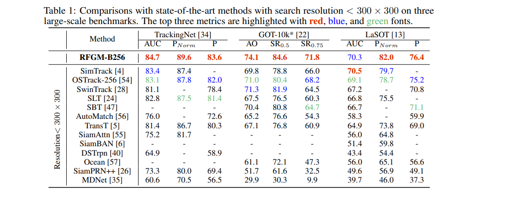

> 接触目标追踪一个学期了，总觉得自己了解的都是表面的东西，没有深刻的洞见也没有好好总结，故决定考完立刻写这篇博客（哎）,这篇博客将重点关注深度学习方法下的目标追踪。

# 传统方法
传统方法我想这个大佬([目标跟踪小总结](https://gsy00517.github.io/computer-vision20200215214240/))已经说的非常详细了，强烈建议大家去看看，虽然现在已经没人做传统了（DL是这样的
# 深度学习方法
## OSTrack——Joint Feature Learning and Relation Modeling for Tracking: A One-Stream Framework
### ABSTRACT
The current popular two-stream, two-stage tracking framework extracts the template and the search region features separately
and then performs relation modeling, thus the extracted features lack
the awareness of the target and have limited target-background discriminability. To tackle the above issue, we propose a novel one-stream
tracking (OSTrack) framework that unifies feature learning and relation
modeling by bridging the template-search image pairs with bidirectional
information flows. In this way, discriminative target-oriented features
can be dynamically extracted by mutual guidance. Since no extra heavy
relation modeling module is needed and the implementation is highly
parallelized, the proposed tracker runs at a fast speed. To further improve the inference efficiency, an in-network candidate early elimination
module is proposed based on the strong similarity prior calculated in the
one-stream framework. 
### Method

1. 这篇论文提出了**比较新的范式**，将Template和Search图片在一开始concat到一起，送入vit当中，与之前Siamese的结构不同，这是完全one-stream,one-stage的结构。

2. 提出了Candidiate Elimination模块，早期候选消除模块的工作流程首先是在目标模板与搜索区域的各个子区域之间计算初步的相似度评分。然后，这些评分与动态调整的阈值进行比较，以确定哪些区域不太可能包含目标。低于该阈值的区域将被立即从后续处理流程中剔除，从而节省计算资源。该阈值根据相似度评分的分布进行自适应调整，确保消除过程在不同场景和目标外观下都具有稳健性。
### 实验结果

## TransformerTrack(CVPR 2021 oral):Transformer Meets Tracker:Exploiting Temporal Context for Robust Visual Tracking
### ABSTRACT
In video object tracking, there exist rich temporal contexts among successive frames, which have been largely
overlooked in existing trackers. In this work, we bridge the
individual video frames and explore the temporal contexts
across them via a transformer architecture for robust object
tracking. Different from classic usage of the transformer in
natural language processing tasks, we separate its encoder
and decoder into two parallel branches and carefully design
them within the Siamese-like tracking pipelines. The transformer encoder promotes the target templates via attentionbased feature reinforcement, which benefits the high-quality
tracking model generation. The transformer decoder propagates the tracking cues from previous templates to the current frame, which facilitates the object searching process.
Our transformer-assisted tracking framework is neat and
trained in an end-to-end manner. With the proposed transformer, a simple Siamese matching approach is able to outperform the current top-performing trackers.
### Method
第一篇将Transformer用到目标追踪的工作（作者自己说的） 
但是细看论文可以发现，这篇工作还是用了CNN提取信息，Transformer更像是辅助的功能，因此作者在论文中说明是transformer-assisted
在目标追踪中，前后帧之间存在着丰富的时间联系，而在传统的追踪框架(Siamese系列和DCF系列)中往往被忽视,而这篇工作提出以Transformer来提取连续帧之间丰富的时间关系，不同于传统NLP中Transformer，作者将级联的Encoder和Decoder分来，并且为了保证模型的轻量性删除了Feedforward层.  
这篇文章的亮点除了使用Transformer来处理连续时间特征之外，保留了Siamese pipeline结构，意味着不需要修改Template Matching相关部分

Transformer Encoder模块允许各个模板特征之间进行相互强化，从而获得更加紧凑且具代表性的目标表示这些经过编码的高质量特征不仅提高了目标表征的精确性，还为后续的追踪模型生成提供了坚实的基础，显著提升了整体追踪性能。

Transformer Decoder在跨帧传递有价值的时间信息方面发挥关键作用。解码器同时传递特征和空间掩码。通过将先前帧的特征传播到当前补丁，能够平滑外观变化并修复上下文噪声；同时，空间注意力的转换突出显示了潜在的目标位置。这些多样化的目标表示和空间线索使得目标搜索过程更加简便和高效。

总结一下创新点:

1.**Encoder-decoder**:与 NLP 任务中采用串联结构不同,将编码器（encoder）和解码器（decoder）分离为两个分支，以适配类Siamese的目标跟踪方法。

2.**Block Weight-sharing**:编码器和解码器中的自注意力模块（图 4 中的黄色框）共享权重，将模板（template）和搜索（search）特征嵌入统一到同一特征空间中，便于后续跨注意力（cross-attention）计算。  
3.**Instance Normalization.** 在 NLP 任务中，词嵌入通常通过层归一化（Layer Normalization）单独进行标准化。我们的方法接收的是图像特征嵌入，因此在实例（图像块）层面联合归一化这些嵌入，以保留图像幅度信息的有用特性。  
4.**Slimming Design**:效率是视觉跟踪场景中的关键因素。为了在速度和性能之间取得平衡，我们通过省略全连接前馈层，仅保留轻量级的单头注意力，精简了经典 Transformer 结构。
### 实验结果

## RFGM(NIPS2024):Reading Relevant Feature from Global Representation Memory for Visual Object Tracking
### ABSTRACT
Reference features from a template or historical frames are crucial for visual
object tracking. Prior works utilize all features from a fixed template or memory
for visual object tracking. However, due to the dynamic nature of videos, the
required reference historical information for different search regions at different
time steps is also inconsistent. Therefore, using all features in the template and
memory can lead to redundancy and impair tracking performance. To alleviate this
issue, we propose a novel tracking paradigm, consisting of a relevance attention
mechanism and a global representation memory, which can adaptively assist the
search region in selecting the most relevant historical information from reference
features. Specifically, the proposed relevance attention mechanism in this work
differs from previous approaches in that it can dynamically choose and build the
optimal global representation memory for the current frame by accessing crossframe information globally. Moreover, it can flexibly read the relevant historical
information from the constructed memory to reduce redundancy and counteract
the negative effects of harmful information
### Method
参考模板或历史帧的特征对于视觉目标跟踪至关重要。以往的研究在视觉目标跟踪中使用固定模板或记忆中的所有特征。然而，由于视频的动态特性，不同搜索区域在不同时间步所需的参考历史信息也是不一致的。因此，使用模板和记忆中的所有特征可能导致冗余，并影响跟踪性能。  
作者引入时总结到之前的两种Memory更新方法，并给出了这篇工作提到的GR Memory示意
  
通俗一点来说就是作者认为之前将所有template都存放在Memory中，在达到最大容量后将最早入Memery的template弹出这种传统的方式造成了Memory中信息冗余，而由于视频的动态特性，target和环境本身也会改变，因此应该更新保存相关性程度大的token，而不是单纯保存所有template。
  
将GR Memory中的token与Template和Search的embedding之后的token送到（TF e.g.token filter）中筛选得到新的更新后的GR Memory中的token(具体更新策略见下文）。将TF筛选出的Token和Search的token一同送入Transformer Block中提取特征，在经过Relevance Attention Transformer Block通过TopK方法京一部筛选参考的Token，如此重复得到Encoder输出的token。之后通过Decoder（主要有score branch,offset branch和size branch),得分分支用于预测目标中心的位置 $R \in [0, 1] H_{16} \times H_{16}$，偏移分支用于补偿由下采样引起的误差 $E \in [0, 1]^{2 \times H_{16} \times H_{16}}$，尺寸分支用于预测目标的高度和宽度 $O \in [0, 1]^{2 \times H_{16} \times H_{16}}$。  
TF模块的示例，也就是如何进行GR Memory的动态更新:
  
  
从公式中可以看到，在保留了有用token并去除多余token的操作下，GR Memory中的Token都是和当前Search图像有高度关联的token，提高了模型的性能，也是我认为此工作的创新点所在
### 实验结果
  
  
# 参考资料
1. [目标跟踪小总结](https://gsy00517.github.io/computer-vision20200215214240/)
2. [OSTrack](https://arxiv.org/pdf/2203.11991)
3. [TransformerTrack](https://arxiv.org/pdf/2103.11681)
4. [RFGM](https://arxiv.org/pdf/2402.14392)